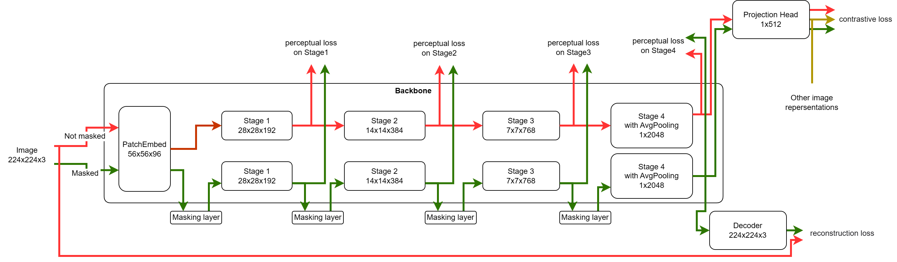

# DDMIM

## Description
A self-supervised pre-training model for image neural networks using masked image modeling, contrastive learning, perceptual learning and self-distillation.
一个图像神经网络自监督预训练模型。使用了掩码图像建模、对比学习、感知学习、自蒸馏。

## Model 

the backbone is SwinT/16.
#### Masking Strategies
mask of each stage  is the downsample of the previous mask 

The first mask is created by Dropout2D.

## Result
|model|Param|pretraining epoches|finetune epoches|top1 Acc.%|
|-|-|-|-|-|
|SwimT/16(Supervised)|28M||100|74.7|
|MAE|22M|150|100|65.1|
|SimMIM|28M|50|100|78.5|
|DDMIMV9(Ours)|30M|50|100|80.1|
|DDMIMV9(Ours)|30M|50|400|81.9|

## Usage

Currently only supports ImageNet-1K.
Uses pytorch-lightning as framework.
Uses pl_boltsd.imagenet_datamodule as dataloader.It needs to manually generate meta.bin

refer to imagenet_datamodule.py:

    Imagenet is no longer automatically downloaded by PyTorch.
    To get imagenet:
    1. download yourself from http://www.image-net.org/challenges/LSVRC/2012/downloads
    2. download the devkit (ILSVRC2012_devkit_t12.tar.gz)
    3. generate the meta.bin file using the devkit
    4. copy the meta.bin file into both train and val split folders

    To generate the meta.bin do the following:

    from pl_bolts.datasets import UnlabeledImagenet
    path = '/path/to/folder/with/ILSVRC2012_devkit_t12.tar.gz/'
    UnlabeledImagenet.generate_meta_bins(path)
#### train
you can run "run.py" to start trainning loop.
the default setting is 

        image_size=224,
        patch_size=16,
        num_classes=1024,
        depths=[2, 2, 6, 2],
        num_heads=[3, 6, 12, 24],
        dim_head=96,
        window_size=7, 
        mlp_ratio=4.,
        channels=3,
        encoder_stride=32,
        masking_ratio=[0.5,0.5,0.5,0.0],
        stagefactor=[1.0,1.0,1.0,0.1],
        lr=5e-3,
        momentum=0.9,
        weight_decay=1e-4,
        tau=0.05,
        alpha=1,
        epsilon=1e-6,
        ema_decay=0.999,
        ema_steps=32,

if you want to change the hyperparameter, you can modify "config/option.py" to customize the max epoch, lr and GPU. Or you can also modify "run.py".
#### finetune
It is similar to trainning except the file to run is "eval.py". It will finetune 100% data on Imagenet-1K.

